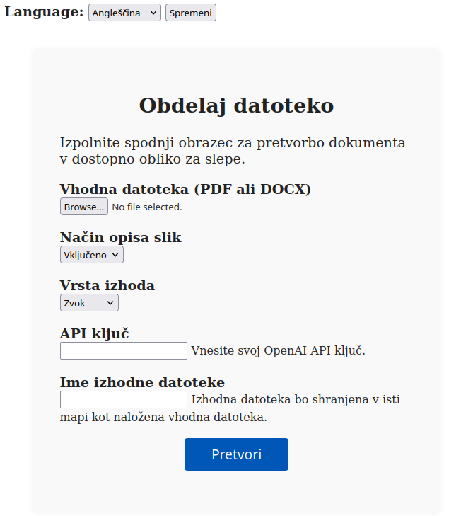
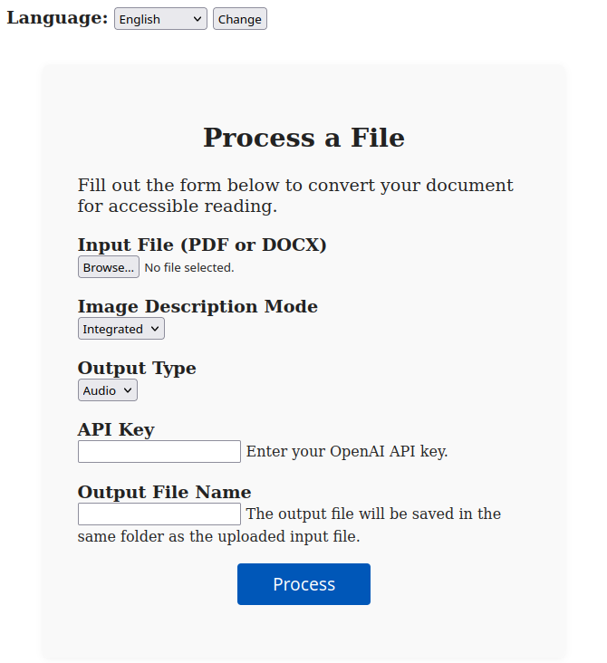

# KrpanAudio

Aplikacija KrpanAudio je bila razvita v okviru hackathona **AdaHack Code for Change 2025** za izziv podjetja **Abelium**:  
🎯 **AI opolnomočen učni pomočnik za slepe in slabovidne**

---

## Avtorice

**Iva Černoša**:  
Idejna zasnova, glavna arhitektura Django web appa (backend in frontend), oblikovanje dostopnega HTML obrazca ter koordinacija ekipe.

**Zala Erčulj**:  
Koda za klasični parsing vhodnih datotek v slike in besedilo (uporaba OCR), logika za izluščanje besedila in slik iz PDF/DOCX brez uporabe LLM, robustnost obdelave dokumentov.

**Nives Sovič**:  
Priprava in optimizacija promptov za LLM, izbor globokih modelov, raziskovanje literature s področja dostopnosti, priprava končnega audia.

---

> [!NOTE]
> **KrpanAudioApp – Summary (EN):**
>
> KrpanAudioApp was developed during the AdaHack Code for Change 2025 hackathon for the challenge set by Abelium:  
> **AI-powered learning assistant for the blind and visually impaired.**
>
> The app converts PDF or DOCX files into accessible formats (TXT or MP3), including image descriptions—either integrated into the surrounding text or inserted as standalone descriptions where images appear.  
> Advanced features (LLM-based parsing, contextual image descriptions, audio conversion) require an OpenAI API key.  
> The entire project is built in Django, and the HTML form is optimized for screen readers.
>
> **Why is this socially impactful?**  
> Images in books and educational materials are often inaccessible to blind and visually impaired users, causing them to miss crucial context and information. By automatically generating and integrating image descriptions, KrpanAudioApp helps bridge this gap, enabling more inclusive access to knowledge, education, and culture for everyone.


## Opis rešitve

Aplikacija je namenjena pretvorbi vhodnih PDF ali DOCX datotek v dostopne oblike za slepe in slabovidne:

- **Besedilne datoteke (TXT)**
- **Avdio datoteke (MP3)**

Dostopnost do slikovnega gradiva v knjigah in učbenikih je za slepe in slabovidne osebe pogosto onemogočena, saj klasični bralniki besedila slike preskočijo ali jih ne opišejo. S tem uporabniki izgubijo pomemben kontekst, informacije in izkušnje, ki jih slike prinašajo v besedilo. Naša rešitev omogoča, da so slike opisane in vključene v besedilo ali avdio, kar bistveno izboljša razumevanje vsebine in omogoča bolj enakovredno izobraževanje ter dostop do informacij.

Takšna rešitev ima pomemben družbeni vpliv, saj prispeva k večji inkluziji, enakopravnosti in samostojnosti slepih in slabovidnih oseb. Omogoča jim polnejšo izkušnjo pri učenju, branju in raziskovanju ter zmanjšuje ovire pri dostopu do znanja in informacij.

Aplikacija omogoča vključevanje opisov slik na dva načina:    
    
- **Ločeno** – Opis slike je vstavljen neposredno na tisto mesto v besedilu, kjer se slika nahaja v izvirnem dokumentu. Tako uporabnik med branjem ali poslušanjem natanko ve, kje se je slika pojavila in kakšna je njena vsebina.    
- **Integrirano** – Opis slike je smiselno vključen v okoliško besedilo, tako da se naravno zlije s kontekstom in ne prekinja toka branja. Opis se lahko poveže z vsebino odstavka ali poglavja, kjer se slika nahaja, kar omogoča bolj tekoče in razumljivo branje oziroma poslušanje.       

Za napredne funkcionalnosti je potreben **OpenAI API ključ**. Brez ključa aplikacija uporablja klasični OCR/parsing in vrne besedilo (txt) ter slike (PNG), v besedilu pa označi, kje se je nahajala posamezna slika z oznakami <slika_x>, kjer je x zaporedna številka slike in se ujema z imenom png slike.

Celoten projekt je narejen v **Django**.  
HTML forma je prilagojena za bralnike za slepe (screen reader accessible).

---

## Workflow

1. Uporabnik naloži PDF ali DOCX datoteko preko spletnega obrazca.
2. Izbere način obdelave slik (integrirano/ločeno) in izhodni format (besedilo/avdio).
3. Po želji vnese OpenAI API ključ za napredne funkcije (LLM parsing, opisovanje slik, pretvorba v avdio).
4. Po potrditvi obrazca aplikacija:
   - Parsira dokument (klasično ali z LLM, odvisno od ključa in izbire).
   - Izlušči besedilo in slike.
   - Opise slik vključi v besedilo po izbranem načinu.
   - Po potrebi pretvori besedilo v avdio (MP3).
   - Shrani izhodne datoteke v mapo poleg izvorne datoteke.

---

## Inputi

- **Vhodna datoteka:** PDF ali DOCX
- **Način opisa slik:** Integrirano / Ločeno
- **Izhodna oblika:** Besedilo (TXT) / Avdio (MP3)
- **OpenAI API ključ:** (opcijsko, za napredne funkcije)
- **Ime izhodne datoteke**

---

## Dostopnost

HTML obrazec je prilagojen za bralnike za slepe in slabovidne.  
<p align="center">
  
  
</p>

---

## Navodila za zagon

### 1. Klasični Python virtualenv

```sh
python -m venv venv
source venv/bin/activate
pip install -r requirements.txt
python manage.py migrate
python manage.py runserver 8000
```

### 2. Conda okolje

```sh
conda env create -f environment.yml
conda activate krpanaudio
python manage.py migrate
python manage.py runserver 8000
```

Po zagonu strežnika je aplikacija dostopna na:  
[http://127.0.0.1:8000/](http://127.0.0.1:8000/)
